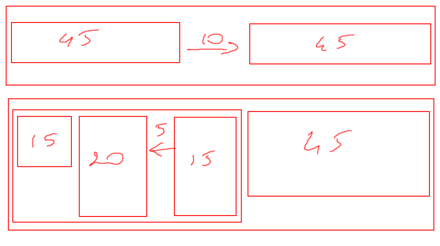
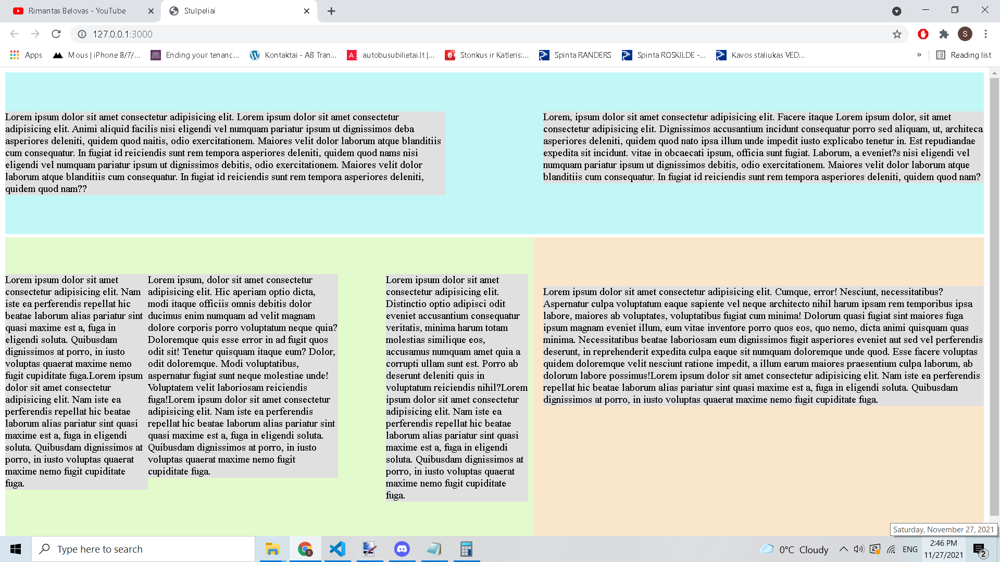

# Stulpeliai

*In this project we are will use methods learned in video lessons.*

- margin: 5%

## Sventa Marija

- widht: 100%
- display: inline-block
- float: left

**Project should look like picture below:**

## Final result (on my screen)

